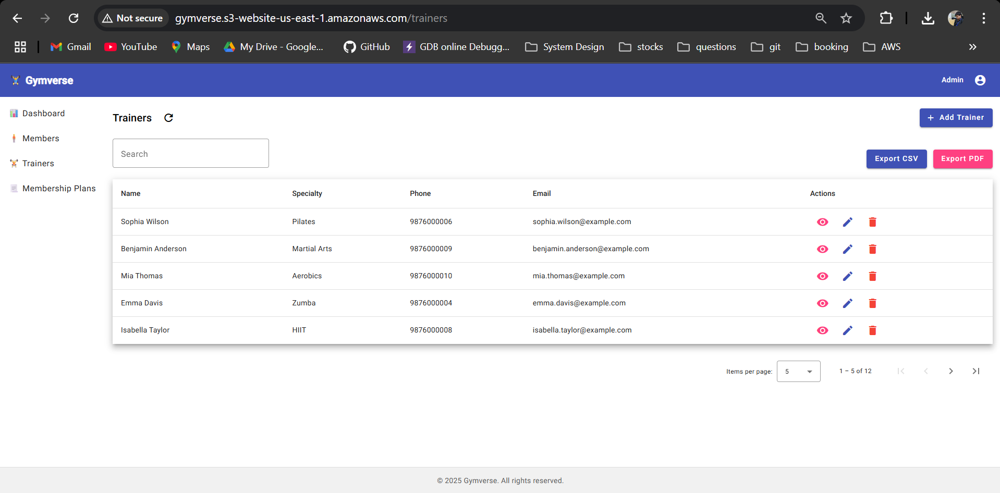

# 🏋️‍♂️ Gymverse – Gym Management Web App

**Gymverse** is a full-stack web application designed for gym owners to manage their members, trainers, and membership plans efficiently. Built with **Angular** for the frontend and **Spring Boot** for the backend, Gymverse integrates features like CRUD operations, data export, visual profiles, and responsive UI — all hosted on **AWS**.

---

## 🚀 Tech Stack

| Frontend      | Backend      | Database  | Hosting      |
|---------------|--------------|-----------|--------------|
| Angular       | Spring Boot  | DynamoDB  | AWS EC2, S3  |

---

## 📸 UI Screenshots

| Dashboard (Monthly) | Dashboard (Quarterly) |
|----------|---------|
|  |  |

| Members | Trainers |
|----------|---------|
|  |  |

| Membership Plans |
|------------------|
|  |

---

## ✅ Features

- 👤 **Member Management**: Add, edit, view, delete members
- 🧑‍🏫 **Trainer Management**: Manage trainer details with profile popup
- 💳 **Membership Plans**: Add, edit, delete plans with pricing & features
- 📄 **Data Export**: Export data as **CSV** or **PDF**
- 🔍 **Smart Table**: Search, sort, pagination (Angular Material)
- 📆 **Auto-expiry Warnings**: Highlight memberships nearing expiry
- 👁️ **Dialog Popups**: View member/trainer profile in dialog
- 🔄 **Loading Indicators**: Overlay spinners for async ops
- ☁️ **AWS Integrated**: Static frontend on S3, EC2 for backend
- 📊 **Dashboard-ready**: Easily extendable with charts and analytics

---

## 📦 Project Setup

### 1. Clone Repositories

```bash
git clone https://github.com/shakya-rohit/gymverse-frontend.git
git clone https://github.com/shakya-rohit/gymverse-backend.git
```

### 2. Run Frontend (Angular)

```bash
cd gymverse-frontend
npm install
ng serve
```

App will be available at `http://localhost:4200`

### 3. Run Backend (Spring Boot)

```bash
cd ../gymverse-backend
./mvnw spring-boot:run
```

API will be available at `http://localhost:8080`

---

## 🧪 Sample API Payloads

### ➕ Create Member

```json
{
  "name": "John Doe",
  "age": 30,
  "membership": "Gold",
  "status": "Active",
  "membershipPlanId": "plan_basic"
}
```

### ➕ Create Trainer

```json
{
  "name": "Ravi Kumar",
  "specialty": "Weight Training",
  "phone": "9876543210",
  "email": "ravi.kumar@example.com"
}
```

### ➕ Create Membership Plan

```json
{
  "planId": "plan_festival",
  "name": "Festival Offer",
  "durationInMonths": 2,
  "price": 1499,
  "features": "Gym access, Diet Plan, Free Water Bottle"
}
```

---

## 📁 Folder Structure (Frontend)

```
gymverse-frontend/
├── src/app/
│   ├── components/
│   │   ├── members/
│   │   ├── trainers/
│   │   ├── membership-plans/
│   │   └── dashboard/
│   ├── services/
│   ├── models/
│   └── app.module.ts
├── screenshots/
└── README.md
```

---

## 👨‍💻 Author

**Rohit Shakya**  
📍 Senior Software Engineer  
📧 rohitshakya930@gmail.com  
🔗 [LinkedIn](https://www.linkedin.com/in/rohitshakya)  
🌐 [Portfolio](https://shakya-rohit.github.io)

---

## ⭐️ Support & Feedback

If you find this project useful, feel free to ⭐ star it on GitHub. Contributions, feedback, and suggestions are welcome!
